# Getting Started
The OSATE Graphical Editor allows viewing and manipulating AADL declarative models in a graphical way.

## Creating a new AADL Package
A new AADL package and an associated diagram can be created by using a wizard.

1. Open the new file dialog by selecting *File->New->Other*...

2. Select *Aadl Package(Graphical)* and select *Next*.

.png)

3. Enter a name for the new package.

4. Select the AADL Project to create the package inside.

5. Select *Finish*.

The new package will appear in the graphical editor.

## Opening an Existing AADL Model
An existing AADL model can be opened in the graphical editor. Changes made to either the AADL source or the diagram will be reflected in the other.

1. Open an existing AADL source file.
	
2. Right-click the AADL package or component in the *Outline* view.
	
3. Select *Open Diagram* to open the diagram for the selected classifier. If a classifier is not selected,
   *Open Diagram* opens the package diagram for the selected package. The diagram will be created if one does
   not already exist. The appropriate diagram will appear in the graphical editor.
	
4. You can also use the keyboard shortcut ***Ctrl+Shift+V*** to switch between the selected element in the
   diagram and the selected element in the source file.
   
# Navigating Between Diagrams
The graphical editor supports navigating between related diagrams in several ways.

## Opening an Associated Diagram
Diagrams associated with a particular element can be opened by double-clicking on the model element. For example, double-clicking a classifier inside a package diagram will open that classifier's diagram. Alternatively, the associated diagram can be open by right-clicking on the element and selecting *Open Associated Diagram* from the context menu.

## Opening an Element's Package Diagram
When viewing a diagram, the package diagram associated with an element can be opened by right-clicking inside the diagram or element and selecting *Go to Package Diagram* from the context menu.

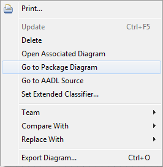

## Opening the Type Diagram for a Component Implementation
When viewing a component implementation diagram, the diagram for the component implementation's type can be opened by right-clicking inside the diagram and selecting *Go to Type Diagram* from the context menu.

## Opening an AADL Instance Model
An AADL instance model can be viewed in the graphical editor. The instance model may not be modified using the graphical editor.

1. Right-click on the AADL instance model in the *AADL Navigator* view.

2. Select *Open Diagram* to open the diagram for the selected component instance. The diagram will be created if one does not already exist.

# Editing AADL Models
The graphical editor allows editing AADL models graphically. As changes are made to the diagram, the AADL model is updated automatically. Additionally, as the textual AADL model is editing using OSATE, the diagram is updated to reflect changes.

Contents

## Basics
Many of the operations in the graphical editor apply to multiple types of elements.

### Deleting
An element can be deleted from the AADL model by selecting it and pressing the ***Delete*** key. An element can also be deleted by right-clicking on it and selecting *Delete* from the context menu.

Elements can only be deleted when viewing the element which contains it. For example, a feature defined in a system type cannot be deleted while editing the diagram of a system implementation.

### Renaming
An element can be renamed using the graphical editor.

1. Select the item to be renamed.

2. Click the name label.  An editable field will appear.

3. Adjust the name as desired.

4. Press the ***Enter*** key.

Elements can only be renamed when viewing the element which contains it. For example, a feature defined in a system type cannot be renamed while editing the diagram of a system implementation.

### Refining
Appropriate elements can be refined by right-clicking on them and selecting *Refine* from the context menu. Once an element is refined. Deleting a refined element will only delete the refinement.

### Instantiating
When viewing a package diagram, component implementations can be instantiated by right-clicking on them and selecting *Instantiate* from the context menu. The instance model will be created in that projects *instances* folder in the AADL Navigator.

### Editing Property Associations
Property associations can be edited using OSATE's *AADL Property Values* view. Selecting an element in the diagram updates the view to show property values for that element.

### Moving Shapes Using Arrow Keys
1. Select the item to be moved.

2. Press the ***.*** key.

3. Using the ***Arrow*** keys, move the item to desired location.

4. Press the ***Enter*** key.

### Selecting a Diagram Element's Container
Under some circumstances, it is difficult to select the desired diagram element due to the location of child diagram elements. The desired shape can be selected using the following steps.

1. Right-click on the child of the diagram element to be selected.

2. Select *Select Container* from the context menu.

### Performing Diagram Layout
When creating a new diagram from an AADL model, the editor lays out the diagram automatically. The layout of the diagram can be redone by right-clicking inside the diagram and select *Layout Diagram*. Doing so will adjust the positions of all the shapes in the diagram.

## Connections
The graphical editor allows editing AADL connections such as access, feature, feature group, parameter, and port.

### Creating Connections
When viewing an implementation diagram, connections can be created by using the palette.

1. Select the appropriate connection type from the palette.

2. Select an appropriate feature as the start of the connection.

3. Select an appropriate feature as the end of the connection.  The new connection will appear.

### Editing Connections
The graphical editor supports refining, binding, configuring in modes, switching direction, and changing between unidirectional and bidirectional for appropriate AADL connections.

#### Using the Context Menu to Edit Connections
Right click on a connection and all appropriate editing options will appear on the context menu.

### Connection_Pattern Property Visualization
When working with arrays, the graphical editor supports visualization of the connection_pattern property. See @sec:arrays.

## Classifiers
The graphical editor allows editing AADL classifiers such as component types, component implementations, and feature groups.

### Creating
When viewing a package diagram, classifiers can be created by using the palette.

1. Open a package diagram.

2. Drag the appropriate classifier type from the palette onto the diagram.

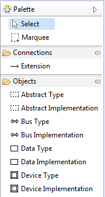

3. If a component implementation was dropped onto the diagram, select the classifier for the implementation to implement or extend.

### Extending
The editor allows classifier extensions to be specified in the package view. That is, the editor allows the specification of type extensions and implementation relationships.

#### Using the Palette to Extend a Classifier
1. While editing a package diagram, select *Extension* from the Palette.

2. Select on the classifier which will be the extension.

3. Select the classifier that is being extended. An arrow will now appear. The type of arrow is determined whether the extension is an implementation or type extension.

#### Using the Context Menu to Set Extended Classifier
Specifying an extension using the context menu allows extending classifiers in other packages.

1. Right-click on the classifier which will be the extension and select *Set Extended Classifier...* from the context menu.

2. Select the classifier to extend.

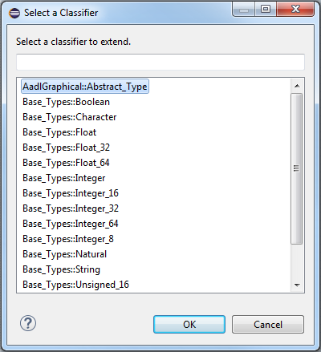

3. Select *OK*. The appropriate arrow indicating the extension will appear.

## Features
The editor allows editing AADL features. Features may be displayed on the left or the right of their container.

### Creating
Features can be created by using the palette.

### Setting the Feature Classifier
The classifier can be set on features such as feature groups, data ports, and access features. Set the classifier by right-clicking on the feature and selecting *Set Classifier...* from the context menu.

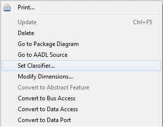

### Setting the Feature Direction (Directional Features Only)
To set the direction of a directional feature, right-click on the feature and select *Set Direction to In*, *Set Direction to Out*, or *Set Direction to In and Out* from the context menu after setting the feature group's classifier.

### Setting Access Kind (Access Features Only)
To set the direction of an access feature, right-click on the feature and select *Set Kind to Provides* or *Set Kind to Requires* from the context menu.

### Setting a Feature Group as Inverse
To set a feature group as either the inverse of or not the inverse of the selected feature group type, right-click on the feature group and select *Set to Inverse* or *Set to Not Inverse* from the context menu.

## Subcomponents
The graphical editor allows editing subcomponents when viewing a component implementation diagram.

### Creating
When viewing a component implementation diagram, a subcomponent can be creating by using the palette. Drag the appropriate subcomponent type from the palette to the desired location. A new subcomponent will appear.

### Setting the Classifier
Select the subcomponent classifier by right-clicking on the subcomponent and selecting *Set Classifier...* from the context menu. After selecting the classifier, the subcomponent will be updated to show the appropriate features.

### Opening the Type Diagram for a Subcomponent
When viewing a component implementation diagram, the diagram for a subcomponent's type can be opened by right-clicking the appropriate subcomponent and selecting *Go to Type Diagram* from the context menu.

### Setting Modes
To set the modes in which subcomponents are active, see @sec:selective_active_components.

## Flows
The graphical editor supports creating and editing flow specifications, flow implementations, and end-to-end flows.

### Creating Flow Specifications
Flow paths, flow sinks, and flow sources can be created using the palette when editing a component type.

#### Creating Flow Paths
1. Select *Flow Path* from the palette.
1. Select the feature to use as the start of the flow path.
1. Select the feature to use as the end of the path. The new flow path will appear.

#### Creating Flow Sinks
1. Select *Flow Sink* from the palette.
1. Select the feature to use as the sink. The new flow sink will appear.

#### Creating Flow Sources
1. Select *Flow Source* from the palette.
1. Select the feature to use as the source. The new flow source will appear.

### Creating Flow Implementations and End-To-End Flow Specifications
When editing a component implementation, flow implementations and end-to-end flow specifications can be created graphically by selecting the *Create Flow Implementation* and *Create End-To-End Flow Specification* tools from the toolbar and following the prompts to select a series of elements from the diagram. The dialog and colors of elements in the diagram will update as valid selections are made. The starting flow specification will be highlighted dark orange and flow elements will be highlighted purple. The *Undo* button will remove the elements in the order they were selected.

#### Creating Flow Implementations
Select *Create Flow Implementation* from the toolbar, the dialog will appear. 

#### Creating Source Flow Implementations
1. Select a valid source flow specification in the top-level component implementation.

2. Select a valid subcomponent flow specification, subcomponent, or data access.

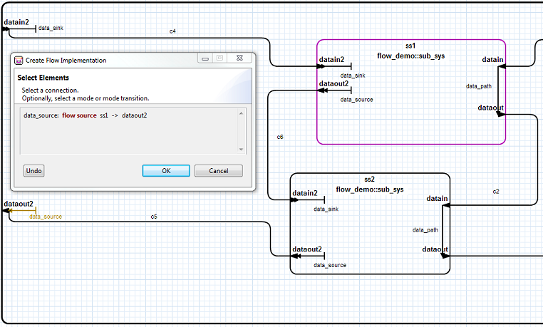

3. Select valid flow segments leading to the source flow specification. Optionally, select modes or mode transitions.

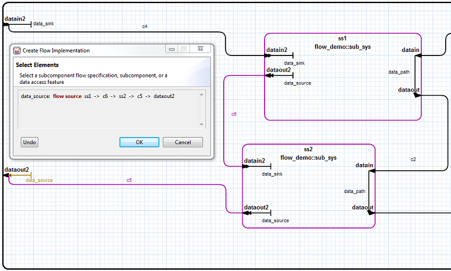

4. Select *OK* when done.

#### Creating Sink Flow Implementations
1. Select a valid sink flow specification in the top-level component implementation.

2. Select a valid connection.

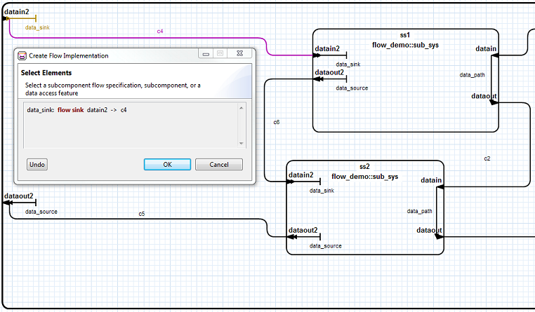

3. Select valid flow segments leading to the end subcomponent flow. Optionally, select modes or mode transitions.

4. Select *OK* when done.

#### Creating Path Flow Implementations
1. Select a valid path flow specification in the top-level component implementation.

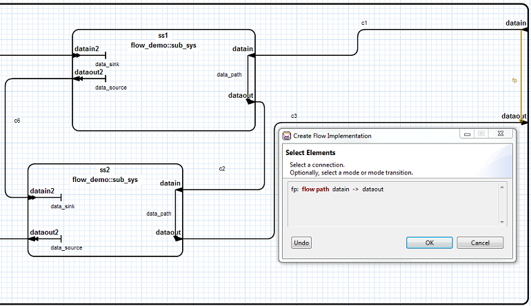

2. Select a valid connection.

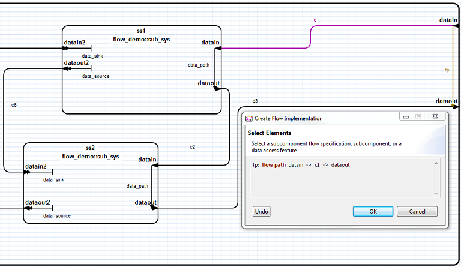

3. Select valid flow segments leading to the path flow specification's out flow end. Optionally, select modes or mode transitions.

4. Select *OK* when done.

#### Creating End-To-End Flow Specifications
Select *Create End-To-End Flow Specification* from the toolbar, the dialog will appear. 

1. Select a valid subcomponent source flow specification.

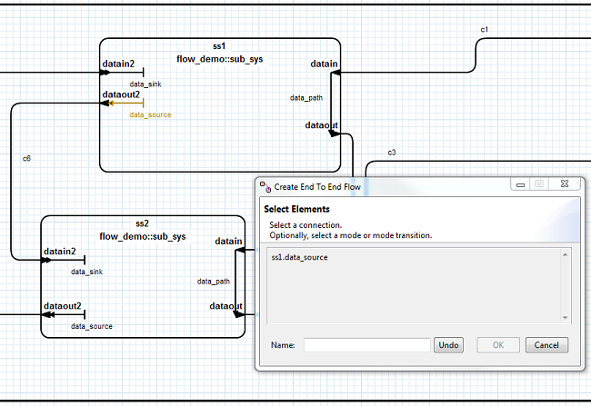

2. Select a valid connection.

3. Select valid flow segments. Optionally, select modes or mode transitions.

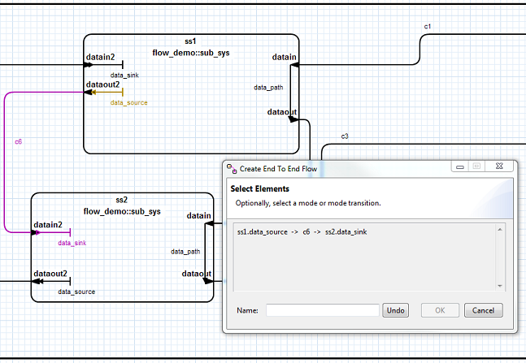

4. Specify a name for the End-To-End Flow Specification and select *OK* when done.

### Editing Flow Implementations and End-to-End Flows
When editing a component implementation, flow implementations and end-to-end flow can be edited using the flow editor. It can be accessed by right-clicking in the diagram and selecting *Edit Flows...* from the context menu.

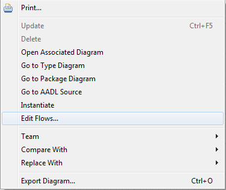

### Highlighting Flow Implementations and End-to-End Flow Specifications
Selecting a flow implementation or end-to-end flow specification from the flow drop-down in the toolbar will highlight the flow.

## Modes
The graphical editor allows editing the modes and mode transitions defined in the AADL model.

### Creating Modes
When editing a component type, modes can be created by selecting *Mode* from the palette.

### Setting the Initial Mode
A mode can be designated as the initial mode by right-clicking on it and selecting *Change to Initial Mode* from the context menu.

### Creating Mode Transitions
Mode transitions can be created using the palette.

1. Select *Mode Transition* from the palette.
2. Select the starting mode.
3. Select the destination mode. The *Select Trigger Ports* dialog will appear.

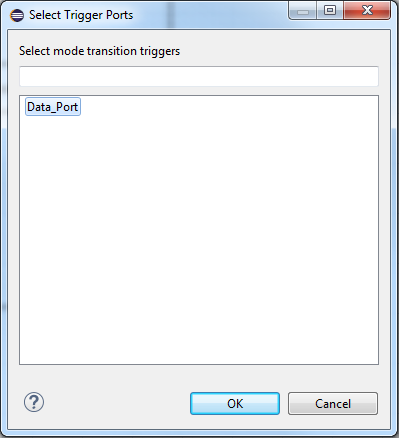

4. Select the ports to use as the triggers for the transition. Multiple ports can be selected by holding down *Ctrl*.
5. Select *OK*. The new mode transition will appear.

### Setting Mode Transition Triggers
A mode transition's trigger ports can be modified by right-clicking on the mode transition and selecting *Set Mode Transition Triggers...* from the context menu.

### Switching Between Derived and Non-derived Modes
The editor allows specifying whether modes declared inside the component type are derived from its containing component. The usage of derived modes corresponds to a component type with a *requires modes* declaration while non-derived modes correspond to a component type with a *modes* declaration. 

The component type can be swapped between using derived and non-derived modes by right-clicking inside the component type and selecting *Change to Derived Modes* or *Change to Non-derived Modes* from the context menu.

### Highlighting
Selecting a mode from the mode drop-down in the toolbar will highlight elements applicable to the mode.

### Selecting Active Components{#sec:selective_active_components}
The editor allows specifying the modes in which a modal element, such as a subcomponent, is active as well as the mapping between modes in the case of derived modes. The modes can be specified by right-clicking on the element and selecting *Configure In Modes...* from the context menu.

## Bindings

### Creating Bindings
When viewing a component implementation diagram, a binding property associations can be created.

### Setting Bindings

#### Using the Toolbar to Set Bindings
1. Select the diagram element for which to set the binding.
2. Select the *Bind...* button from the toolbar. 

3. From the Bind dialog, select a binding property from the drop-down menu.

4. Select one or more elements from the diagram to bind to the initially selected element.
5. Select *OK*.

#### Using the Context Menu to Set Bindings
1. Right-click on the diagram element for which to set the binding.
2. Select *Bind...* from the context menu.

3. From the Bind dialog, select a binding property from the drop-down menu.
4. Select one or more elements from the diagram to bind to the initially selected element.
5. Select *OK*.

## Arrays{#sec:arrays}
The graphical editor supports creating arrays for appropriate features and subcomponents.

### Creating Arrays
When viewing a component type diagram or component implementation diagram, a feature or subcomponent array can be created, respectively.

1. Right-click on the appropriate element.
2. Select *Modify Dimensions...* from the context menu.
3. From the Modify Dimensions dialog, select *Add*, then *Modify*.

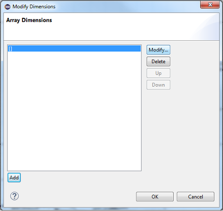

4. From the Modify Dimension dialog, select desired type and value.

5. Select *OK*. The array dimensions will appear on the element.

### Editing Arrays
To edit an array, right-click on a feature or subcomponent array and select *Modify Dimensions...* from the context menu.

#### Add Dimension
1. From the *Modify Dimensions* dialog, select *Add*, then *Modify*.

2. From the *Modify Dimension* dialog, select desired type and value.

3. Select *OK*. The new array dimension will appear.

#### Change Dimension Order
From the *Modify Dimensions* dialog, select the desired dimension and select *Up* or *Down*.

#### Delete Dimension
From the *Modify Dimensions* dialog, select the desired dimension and select *Delete*.

## Subprogram Call Sequences
The graphical editor supports creating and editing subprogram call sequences.

### Creating Subprogram Call Sequences
When viewing a thread implementation diagram, subprogram call sequences can be created.

1. Select *Subprogram Call Sequence* from the palette and select inside the thread implementation diagram.
2. In the *Select Subprogram* dialog, select desired type and subprogram component.

3. Select *OK*. The new call sequence will appear.

#### Adding Subprogram Calls
When viewing a thread implementation diagram that contains a subprogram call sequence, a subprogram call can be added to the sequence.

1. Select *Subprogram Call* from the palette and select inside the subprogram call sequence diagram.
1. In the *Select Subprogram* dialog, select desired type and subprogram component.
1. Select *OK*. The new subprogram call will appear.

### Editing Subprogram Call Sequences
To change a subprogram call's place in the order of a subprogram call sequence, right-click on the desired subprogram call and select *Move Up* or *Move Down*.

## Annexes
The graphical editor supports creating Annex Libraries and Annex Subclauses in appropriate AADL packages and classifiers, respectively.

### Creating Annex Libraries and Annex Subclauses
Annex Libraries and Annex Libraries can be created by using the palette.

1. Drag the appropriate annex type from the palette onto the diagram, a dialog will appear.

2. Type in a valid name for the new annex and select *OK*.

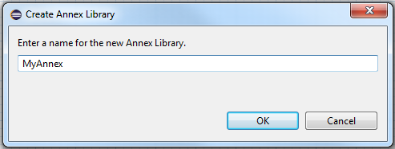

## Layouts
The graphical editor allows for the layout of appropriate elements to be set to radial or grid.

### Grid Layout
1. Select the elements for which to set the layout.
1. Select the *Grid Layout* button from the toolbar.

### Radial Layout
1. Select the elements for which to set the layout.
1. Select the *Radial Layout* button from the toolbar.

	
# Troubleshooting
The following section contains solutions to known issues as well as instructions for reporting problems with the graphical editor.

## Build Automatically
*Project->Build Automattically* must be enabled.  If it is not enabled, the graphical editor will not function properly.

## Inconsistent Font Sizes Across Machines
To ensure diagrams have a consistent appearance across machines, the graphical editor attempts to produce consistent text sizes regardless of system settings. However, due to limitations in the underlying libraries on which the graphical editor relies, this is not always possible. On windows systems, the graphical editor produces consistent font sizes at 100%, 125%, and 200% system text scaling levels.

## Out of Handles Exception
When working with extremely large models, the graphical editor may run out of graphics handles. To work around this issue, reduce the number of graphics handles used by splitting the model into smaller packages.

## Unable to Set Properties Unless Text Model is Open
The AADL Property Values view does not support editing property associations unless the textual AADL model is open. To work around this issue, open the textual AADL file before attempting to create property assignments with the AADL Properties Values view.

## Updating the Diagram
In most cases the graphical editor will automatically update diagrams to reflect changes to the AADL Model. If a diagram has not been updated for any reason, it can be updated manually by right-clicking inside an empty area of the diagram and selecting *Update* from the context menu.

## Reporting Bugs
Bugs should be reported to the issue tracker on the graphical editor's [GitHub Site](https://github.com/osate/osate-ge).

# Notices
Development of portions of the OSATE Graphical Editor was sponsored by the Government of the United States under Contract Number FA8702-15-D-0002.

The view, opinions, and/or filings contained in this material are those of the author(s) and should not be construed as an official position, policy, or decision of the Government of the United States or Carnegie Mellon University or the Software Engineering Institute, unless designated by other documentation.
